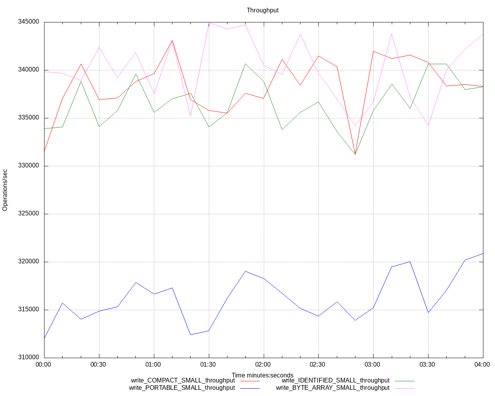
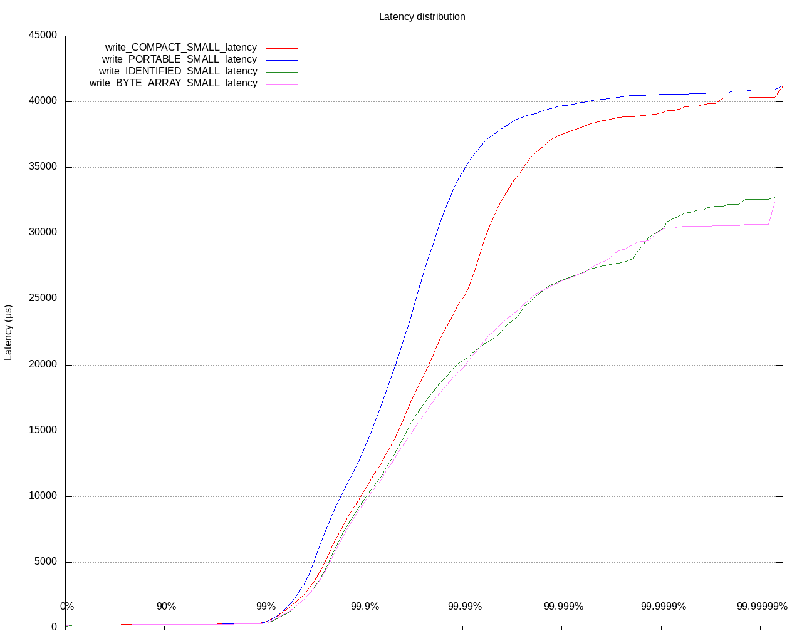
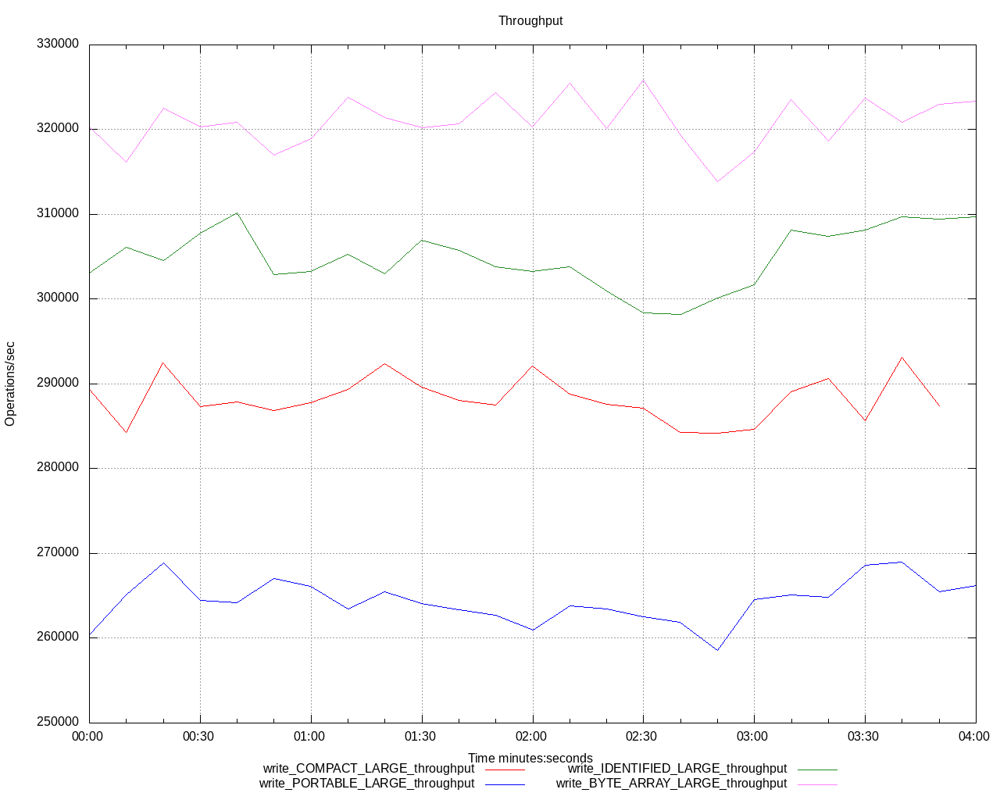
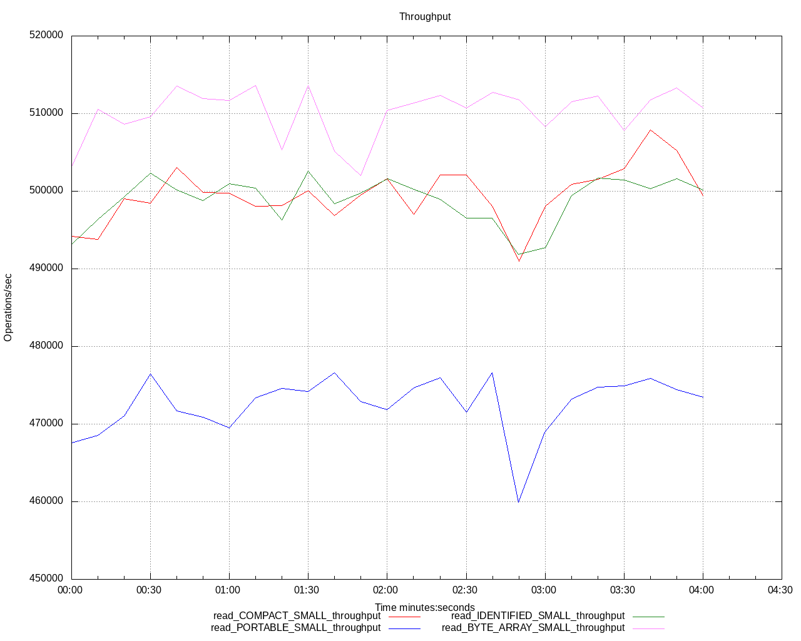
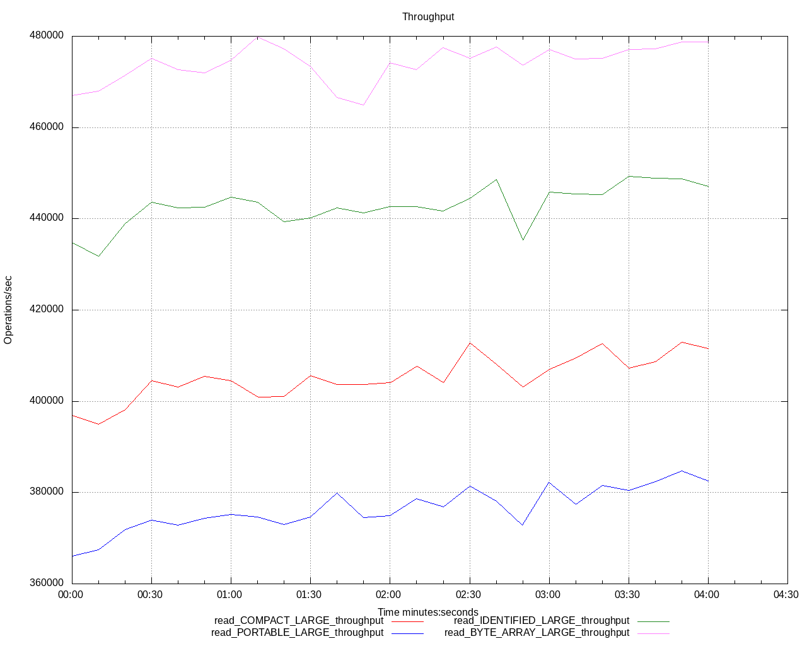
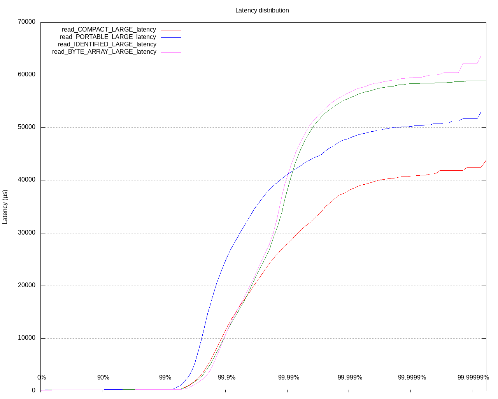
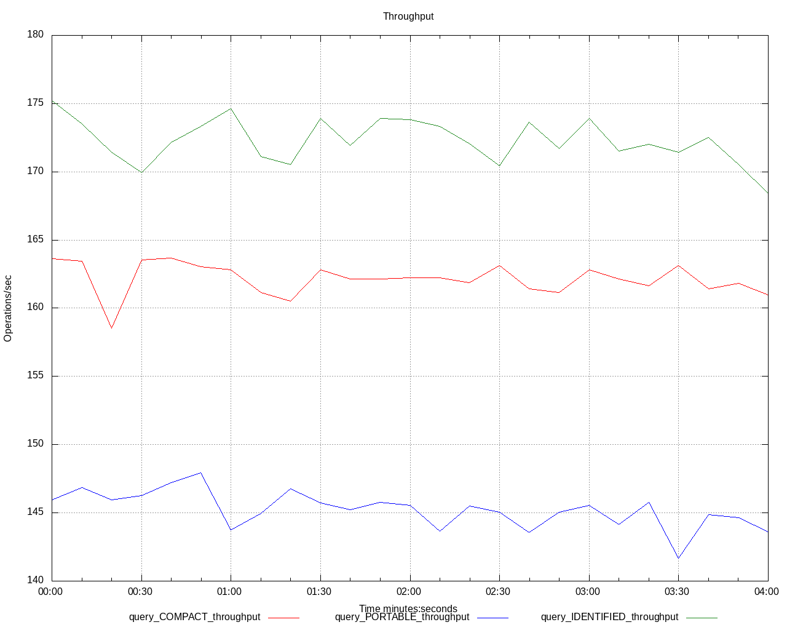

# Compact Benchmark

This project contains the simulator tests to compare
the new serialization format (called Compact) with
the other Hazelcast alternatives such as Portable and
IdentifiedDataSerializable. Also, in some of the tests,
we will use a byte array with the size similar to 
serialized size of the IdentifiedDataSerializable objects
and use that as a baseline.

The test code defines two types of objects:
small and large, in terms of the number of fields they
have.

Small objects have the following fields:

- int
- long
- double
- String

Large objects have the following fields:

- boolean
- boolean[]
- byte
- byte[]
- short
- short[]
- int
- int[]
- long
- long[]
- float
- float[]
- double
- double[]
- String
- String[]
- nested small object
- an array of nested small objects

The fields are chosen so that they are supported in the
serialization formats we test out-of-the-box (with the
exception that, an array of nested small objects for
IdentifiedDataSerializable, but it was pretty easy to
represent that with the equivalent layout in the binary
by writing the length and the array items one by one.).

There are four types of benchmarks executed.

## Write Benchmark

Write benchmark performs ``map#set`` (not
``map#put`` to not deal with the deserialization of the
old value) over and over. The item count of the map
is limited to ``100_000`` items.

The benchmark is parameterized over two properties: object kind
and object size. Object kind represents the kind of objects
that will be written into a map, as ``COMPACT``, ``PORTABLE``,
``IDENTIFIED``, and ``BYTE_ARRAY``. Object size controls the 
number of fields, as described above, and takes the values 
of ``SMALL`` and ``LARGE``. So, we will test eight different 
setups and measure throughput and latency separately, which 
results in fourteen test runs.

At the end of the test, we will also report the number of
entries in the map and the memory cost of those entries
in the log, so that we can compare that as well, along with
the throughput and latency numbers.

To not deal with the cost of random object generation, and
truly measure the cost of serialization and writes, in the
write test, we will create objects with the same values
in the setup phase, and write that to the map as a value
for every key.

## Read Benchmark

Read benchmark is structured as same as the write benchmark
described above.

In the setup phase, we will fill the map with randomized
values. However, the different test setups do not measure
the cost of reading the potentially different values because
the random field generator is seeded with the same value
and we have fixed lengths for variable-sized fields (like
fixed-length random strings, fixed-length arrays). So, every
object in the map has the same size, in terms of the size
of their fields.

## Query Benchmark

The query benchmark is structured differently than the other
two benchmarks, as we are using the new SQL engine in the
benchmarks, and it does not support arrays and nested objects
yet. So, the query benchmark is not parameterized over the
object sizes, but only over the object kinds. Also, we won't
use the ``BYTE_ARRAY`` object kind, as it is not logical
to have it in this test setup.

In the timestep method of the benchmark, we execute
the following query over and over.

```SQL
SELECT * FROM map_name WHERE stringField = 'metin'
```

## Query Benchmark - Old Query Engine

This is the same query test but runs against the old
query engine using ``map#values`` with an ``EqualPredicate``.

Also, since the old engine supports arrays and nested objects,
so we also parameterized the tests over objects sizes as well.

In the timestep method of the benchmark, we execute
the following query over and over.

```java
map.values(Predicates.equal("stringField", "metin"));
```

# Benchmark Setup

The benchmarks are run on the LAB machines we have.
We have dedicated two machines to two members and used
the other machine for clients and initiated twelve clients
there to generate an adequate amount of load.

We haven't modified any defaults and used everything
as it is. So, it might be possible to get better results
with better configurations in this test but the results
we get should not be much different, as we are mainly
interested in how the new format is doing compared
to other alternatives we have.

The scripts used in the benchmarks can be found in the
``workdir`` folder.

# Running Benchmark

I have created a simple Python script to execute matrix
of different benchmark setups (``test_runner.py``).

It can be executed with commands like

```bash
python test_runner.py --[query|read|write|old-engine-query]
```

to execute different kinds of benchmarks. It takes care
of configuring the ``test.properties`` according to
matrix elements and executes the tests.

Or, you can use the ``run.sh`` and configure the
``test.properties`` manually.

The query benchmark requires ``hazelcast-sql`` JAR, so make
sure to provide that in the ``workdir/upload`` folder.

Also, if you are going to use ``bringmyown`` ``VERSION_SPEC``
in the ``simulator.properties``, don't forget to put
``hazelcast`` JAR into the aforementioned folder as well.

# Results

## Write

### Write Small Objects - Throughput



|            | Entry Count | Memory Cost | Memory Cost Per Entry* |
| ---------- | ----------- | ----------- | ---------------------- |
| COMPACT    | 100000      | 18400000    | 184                    |
| PORTABLE   | 100000      | 26200000    | 262                    |
| IDENTIFIED | 100000      | 18000000    | 180                    |
| BYTE_ARRAY | 100000      | 18400000    | 184                    |

> Reported as the sum of ``OwnedEntryMemoryCost`` of all members
> local map stats divided by the entry count.

### Write Small Objects - Latency



### Write Large Objects - Throughput



|            | Entry Count | Memory Cost | Memory Cost Per Entry |
| ---------- | ----------- | ----------- | --------------------- |
| COMPACT    | 100000      | 54600000    | 546                   |
| PORTABLE   | 100000      | 103700000   | 1037                  |
| IDENTIFIED | 100000      | 50800000    | 508                   |
| BYTE_ARRAY | 100000      | 51200000    | 512                   |


### Write Large Objects - Latency


## Read

### Read Small Objects - Throughput



|            | Entry Count | Memory Cost | Memory Cost Per Entry |
| ---------- | ----------- | ----------- | --------------------- |
| COMPACT    | 100000      | 17200000    | 172                   |
| PORTABLE   | 100000      | 25000000    | 250                   |
| IDENTIFIED | 100000      | 16800000    | 168                   |
| BYTE_ARRAY | 100000      | 17200000    | 172                   |


### Read Small Objects - Latency


### Read Large Objects - Throughput



|            | Entry Count | Memory Cost | Memory Cost Per Entry |
| ---------- | ----------- | ----------- | --------------------- |
| COMPACT    | 100000      | 60000000    | 600                   |
| PORTABLE   | 100000      | 116600000   | 1166                  |
| IDENTIFIED | 100000      | 56300000    | 563                   |
| BYTE_ARRAY | 100000      | 56700000    | 567                   |


### Read Large Objects - Latency



## Query

### Query - Throughput



### Query - Latency


## Query - Old Engine

### Query - Old Engine - Small Objects - Throughput


### Query - Old Engine - Small Objects - Latency


### Query - Old Engine - Large Objects - Throughput


### Query - Old Engine - Large Objects - Latency


